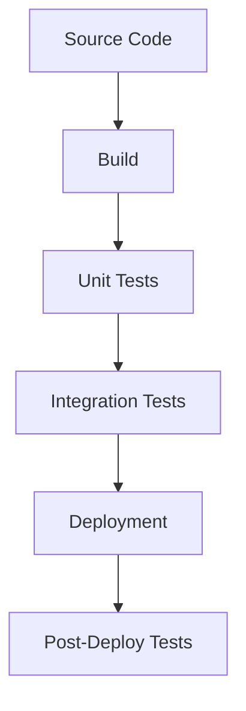

# CI/CD Integration Challenges

<ChallengeDifficulty :rating="4" />
<TimeEstimate time="2-3 days" />

## Executive Summary
This challenge addresses integrating testing into CI/CD pipelines effectively while maintaining quality and speed.

## Problem Statement
Organizations need to:
- Automate test execution
- Maintain fast feedback loops
- Handle test failures
- Manage test environments
- Balance speed and quality

## Technical Context


## Solution Approaches

### 1. Pipeline Configuration
```yaml
name: Test Pipeline

on: [push, pull_request]

jobs:
  test:
    runs-on: ubuntu-latest
    steps:
      - uses: actions/checkout@v2
      - name: Setup Node.js
        uses: actions/setup-node@v2
      - name: Install Dependencies
        run: npm ci
      - name: Run Tests
        run: npm test
      - name: Upload Coverage
        uses: actions/upload-artifact@v2
        with:
          name: coverage
          path: coverage/
```

### 2. Test Optimization
- Implement test parallelization
- Use test splitting strategies
- Cache test resources

### 3. Environment Management
- Use dynamic environments
- Implement cleanup strategies
- Manage test data

## Expert Tips
- Optimize test execution
- Implement proper reporting
- Monitor pipeline health
- Handle flaky tests

## References
- [Jenkins Pipeline Guide](https://www.jenkins.io/doc/book/pipeline/)
- [GitHub Actions Documentation](https://docs.github.com/en/actions)