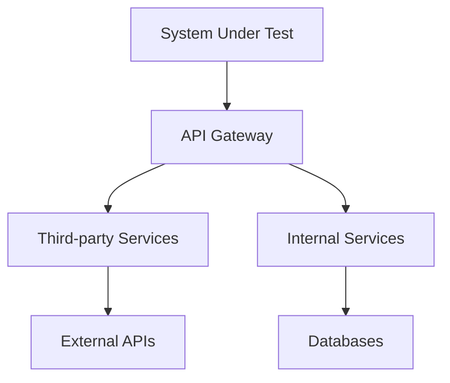

# Integration Testing Challenges

<ChallengeDifficulty :rating="3" />
<TimeEstimate time="2-3 days" />

## Executive Summary
This challenge focuses on effectively testing integrations with third-party services and ensuring reliable system interactions.

## Problem Statement
Testing teams need to:
- Verify third-party integrations
- Handle external dependencies
- Manage test environments
- Ensure data consistency
- Test error scenarios

## Technical Context


## Solution Approaches

### 1. Contract Testing
```typescript
import { Pact } from '@pact-foundation/pact';

const provider = new Pact({
  consumer: 'MyService',
  provider: 'PaymentAPI'
});

describe('Payment Service', () => {
  it('processes payments', async () => {
    await provider.addInteraction({
      state: 'a payment request',
      uponReceiving: 'a valid payment',
      withRequest: {
        method: 'POST',
        path: '/payments',
        body: { amount: 100 }
      },
      willRespondWith: {
        status: 200,
        body: { id: '123', status: 'success' }
      }
    });
  });
});
```

### 2. API Testing
- Use Postman collections
- Implement automated API tests
- Monitor API health

### 3. Environment Management
- Use containerization
- Implement service virtualization
- Manage test data

## Expert Tips
- Use contract testing
- Implement proper mocking
- Monitor integration points
- Handle failures gracefully

## References
- [Pact Documentation](https://docs.pact.io/)
- [API Testing Guide](https://www.postman.com/api-testing-guide/)