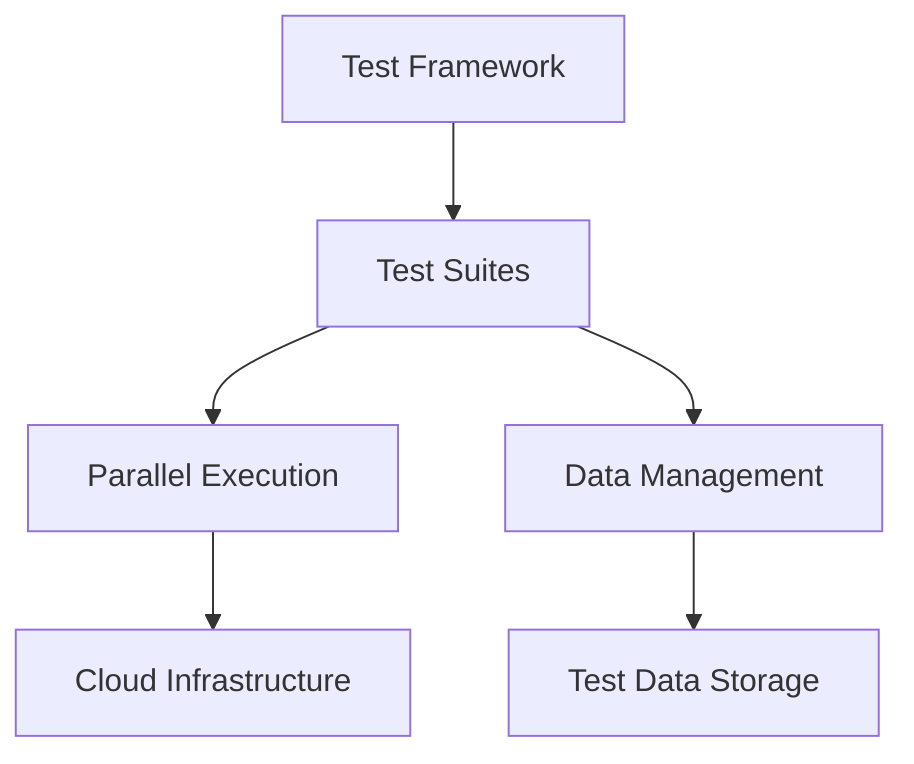

# Scalability of Test Automation

<ChallengeDifficulty :rating="4" />
<TimeEstimate time="2-3 days" />

## Executive Summary
This challenge addresses maintaining and scaling test automation frameworks as your testing needs grow.

## Problem Statement
Organizations need to:
- Scale test automation across multiple projects
- Maintain test suite performance
- Handle increasing test data volumes
- Manage test execution time
- Support parallel execution

## Technical Context


## Solution Approaches

### 1. Framework Architecture
```typescript
interface TestConfig {
  parallel: boolean;
  workers: number;
  retries: number;
  timeout: number;
}

class TestRunner {
  async executeTests(config: TestConfig) {
    const suites = await this.discoverTests();
    const runner = new ParallelRunner(config);
    
    return runner.execute(suites);
  }
}
```

### 2. Cloud Integration
- Implement cloud-based execution
- Use containerized environments
- Scale resources dynamically

### 3. Data Management
- Implement data factories
- Use parallel data generation
- Manage test isolation

## Expert Tips
- Start with scalable architecture
- Implement proper parallelization
- Use cloud resources efficiently
- Monitor execution metrics

## References
- [Selenium Grid Documentation](https://www.selenium.dev/documentation/grid/)
- [Test Automation Patterns](https://testautomationpatterns.org/)