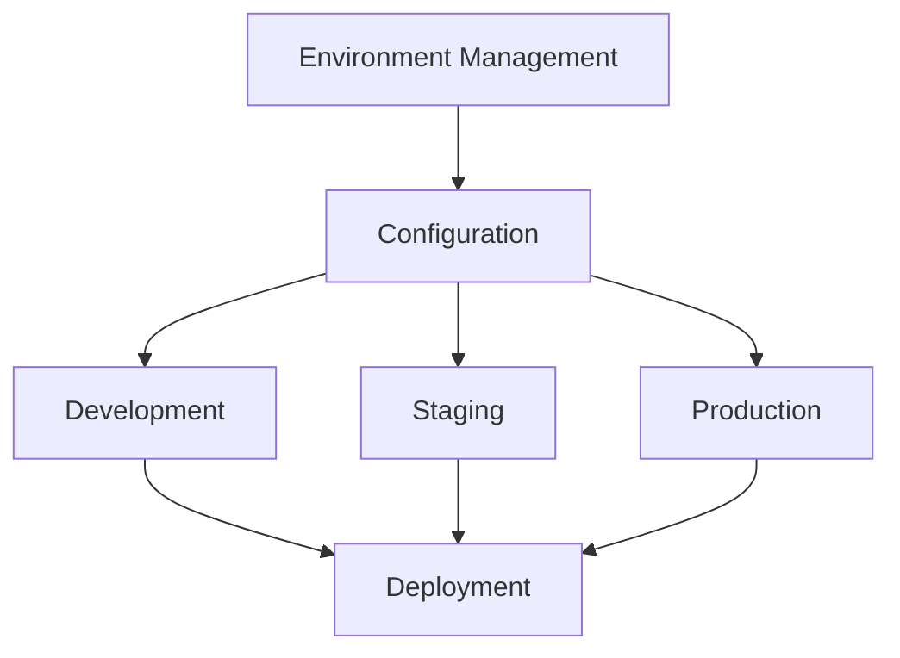

# Test Environment Management

<ChallengeDifficulty :rating="3" />
<TimeEstimate time="Ongoing" />

## Executive Summary
This challenge addresses the complexities of managing and maintaining consistent test environments across different stages of testing.

## Problem Statement
Organizations need to:
- Maintain consistent environments
- Manage configurations
- Handle environment dependencies
- Ensure scalability
- Implement security controls

## Technical Context


## Solution Approaches

### 1. Environment Configuration
```typescript
interface Environment {
  name: string;
  type: 'development' | 'staging' | 'production';
  config: {
    resources: Record<string, any>;
    dependencies: string[];
    security: Record<string, any>;
  };
}

class EnvironmentManager {
  async setupEnvironment(env: Environment) {
    // Validate configuration
    await this.validateConfig(env.config);
    
    // Setup resources
    await this.provisionResources(env.config.resources);
    
    // Configure security
    await this.setupSecurity(env.config.security);
    
    return this.verifyEnvironment(env);
  }
}
```

### 2. Infrastructure as Code
- Terraform configurations
- Docker containers
- Kubernetes orchestration

### 3. Environment Monitoring
- Health checks
- Resource utilization
- Security scanning

## Expert Tips
- Use version control
- Implement automation
- Regular maintenance
- Security best practices

## References
- [Environment Management](https://example.com/env-management)
- [IaC Best Practices](https://example.com/iac)