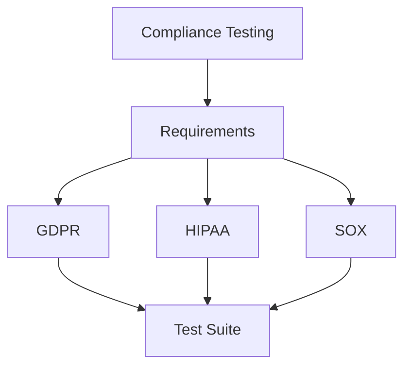

# Regulatory Compliance Testing

<ChallengeDifficulty :rating="4" />
<TimeEstimate time="Ongoing" />

## Executive Summary
This challenge focuses on ensuring software systems meet various regulatory requirements while maintaining efficient testing processes.

## Problem Statement
Organizations need to:
- Meet industry regulations
- Maintain compliance documentation
- Implement security controls
- Handle sensitive data properly
- Regular compliance audits

## Technical Context


## Solution Approaches

### 1. Compliance Framework
```typescript
interface ComplianceRequirement {
  regulation: string;
  controls: {
    id: string;
    description: string;
    testCases: string[];
    evidence: string[];
  }[];
}

class ComplianceTesting {
  async verifyCompliance(requirements: ComplianceRequirement[]) {
    const results = [];
    
    for (const req of requirements) {
      const controlResults = await this.testControls(req.controls);
      results.push({
        regulation: req.regulation,
        results: controlResults,
        timestamp: new Date()
      });
    }
    
    return this.generateComplianceReport(results);
  }
}
```

### 2. Security Controls
- Access control testing
- Data encryption verification
- Audit trail implementation

### 3. Documentation Management
- Evidence collection
- Audit preparation
- Compliance reporting

## Expert Tips
- Regular compliance reviews
- Automated compliance checks
- Clear documentation
- Team training

## References
- [GDPR Guidelines](https://example.com/gdpr)
- [HIPAA Compliance](https://example.com/hipaa)