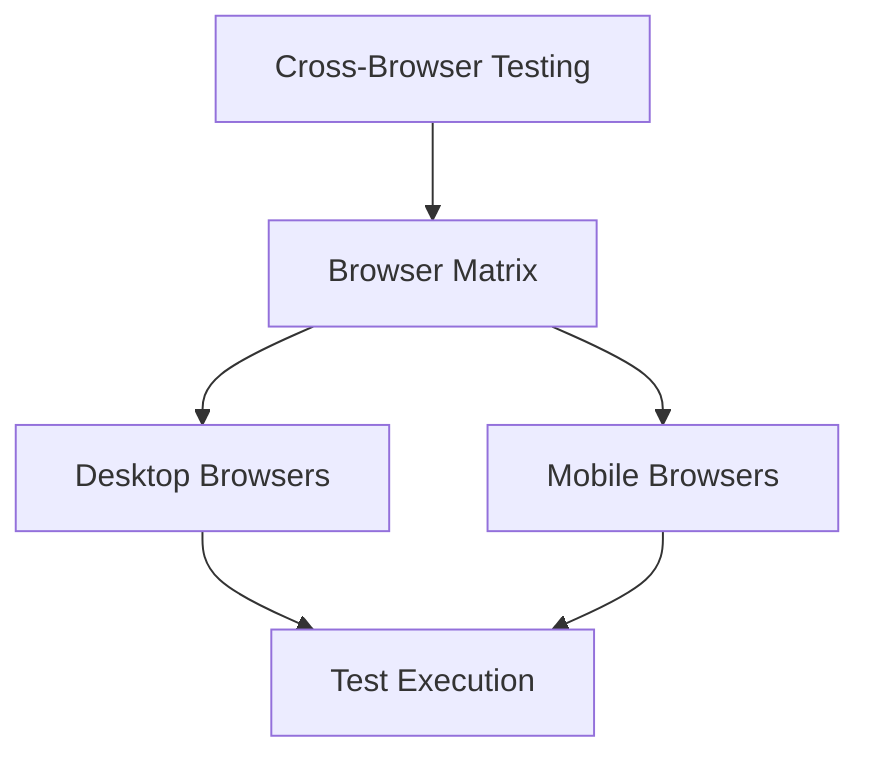

# Cross-Browser Testing

<ChallengeDifficulty :rating="3" />
<TimeEstimate time="2-3 days" />

## Executive Summary
This challenge focuses on implementing effective cross-browser testing strategies to ensure consistent application behavior across different browsers and platforms.

## Problem Statement
Organizations need to:
- Test across multiple browsers
- Ensure consistent UI/UX
- Handle browser-specific features
- Manage test infrastructure
- Automate cross-browser testing

## Technical Context


## Solution Approaches

### 1. Test Infrastructure Setup
```typescript
interface BrowserConfig {
  name: string;
  version: string;
  platform: string;
  mobile?: boolean;
}

class CrossBrowserTesting {
  async runTests(config: BrowserConfig[]): Promise<TestResults> {
    const results = [];
    for (const browser of config) {
      const result = await this.executeTestSuite(browser);
      results.push(result);
    }
    return this.analyzeResults(results);
  }
}
```

### 2. Automation Framework
- Selenium WebDriver
- Playwright
- Cypress

### 3. Cloud Testing Platforms
- BrowserStack
- Sauce Labs
- LambdaTest

## Expert Tips
- Prioritize browser coverage
- Use cloud platforms
- Implement parallel testing
- Monitor browser usage stats

## References
- [Selenium Documentation](https://www.selenium.dev/documentation/)
- [Playwright Documentation](https://playwright.dev/)
- [Cypress Documentation](https://docs.cypress.io/)