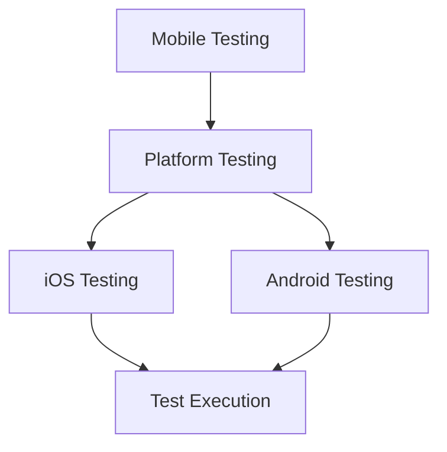

# Mobile Testing

<ChallengeDifficulty :rating="4" />
<TimeEstimate time="2-3 days" />

## Executive Summary
This challenge addresses comprehensive mobile application testing across different devices, operating systems, and form factors.

## Problem Statement
Testing teams need to:
- Test across multiple devices
- Support various OS versions
- Handle different screen sizes
- Test mobile-specific features
- Ensure performance optimization

## Technical Context


## Solution Approaches

### 1. Device Lab Setup
```typescript
interface DeviceMatrix {
  devices: {
    name: string;
    os: 'iOS' | 'Android';
    version: string;
    screenSize: string;
  }[];
}

class MobileTestStrategy {
  async executeTests(matrix: DeviceMatrix): Promise<TestResults> {
    const results = [];
    for (const device of matrix.devices) {
      const result = await this.runTestSuite(device);
      results.push(result);
    }
    return this.analyzeResults(results);
  }
}
```

### 2. Automation Framework
- Appium
- XCUITest
- Espresso

### 3. Cloud Testing Services
- Firebase Test Lab
- AWS Device Farm
- Perfecto

## Expert Tips
- Use real devices for critical testing
- Implement CI/CD integration
- Monitor device analytics
- Test offline scenarios

## References
- [Appium Documentation](https://appium.io/docs/en/2.0/)
- [XCUITest Documentation](https://developer.apple.com/documentation/xctest)
- [Espresso Documentation](https://developer.android.com/training/testing/espresso)