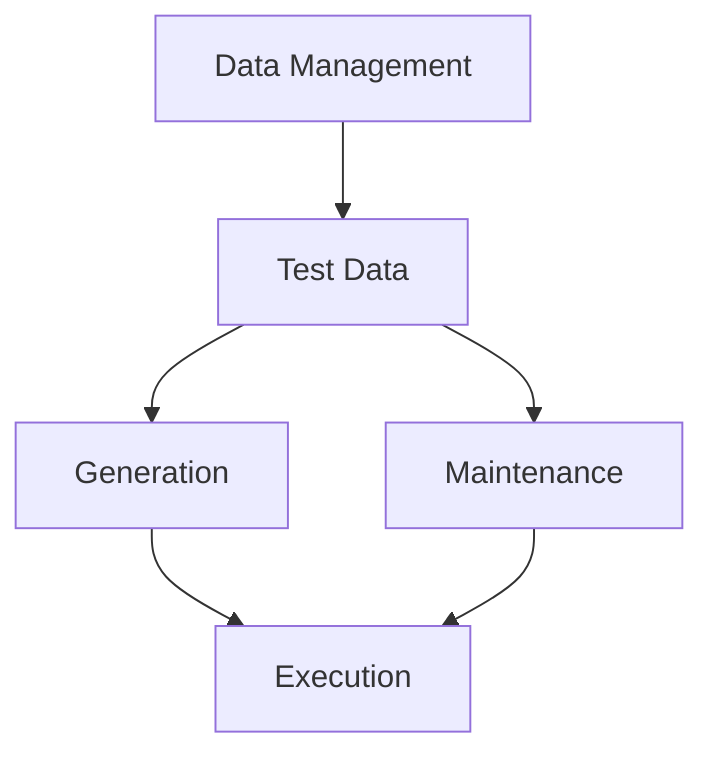

# Data Management in Testing

<ChallengeDifficulty :rating="3" />
<TimeEstimate time="2-3 days" />

## Executive Summary
This challenge focuses on effective test data management strategies, ensuring data quality, and maintaining test data across different environments.

## Problem Statement
Organizations need to:
- Manage test data effectively
- Ensure data consistency
- Handle sensitive data
- Maintain test environments
- Automate data generation

## Technical Context


## Solution Approaches

### 1. Data Management Framework
```typescript
interface TestData {
  type: 'static' | 'dynamic';
  sensitivity: 'high' | 'medium' | 'low';
  generator?: () => Promise<any>;
  cleanup?: () => Promise<void>;
}

class TestDataManager {
  async prepareTestData(config: TestData): Promise<any> {
    if (config.type === 'dynamic') {
      return await config.generator();
    }
    return this.getStaticTestData();
  }
}
```

### 2. Data Generation
- Faker libraries
- Custom generators
- Data factories

### 3. Data Maintenance
- Version control
- Environment isolation
- Cleanup routines

## Expert Tips
- Use data factories
- Implement proper cleanup
- Version control test data
- Handle sensitive data securely

## References
- [Test Data Management Guide](https://www.example.com/tdm)
- [Data Generation Patterns](https://www.example.com/patterns)