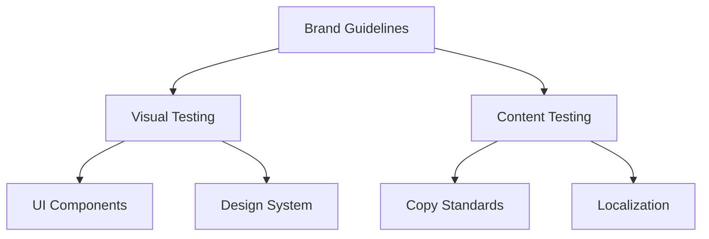

# Brand Consistency Testing

<ChallengeDifficulty :rating="3" />
<TimeEstimate time="2-3 days" />

## Executive Summary
This challenge addresses maintaining consistent brand standards across multiple applications while ensuring proper testing coverage for brand-specific requirements.

## Problem Statement
Organizations need to:
- Test brand compliance
- Maintain visual consistency
- Verify content standards
- Handle multiple brands
- Ensure accessibility

## Technical Context


## Impact Assessment
### Business Impact
- Brand perception
- Customer trust
- Market positioning
- Compliance issues

### Technical Impact
- Testing complexity
- Maintenance overhead
- Integration challenges
- Resource utilization

## Solution Approaches

### 1. Visual Regression Testing
```typescript
interface BrandSpec {
  colors: {
    primary: string;
    secondary: string;
    accent: string[];
  };
  typography: {
    fonts: string[];
    sizes: number[];
  };
  spacing: number[];
}

class BrandTesting {
  async verifyBrandCompliance(
    component: string,
    brandSpec: BrandSpec
  ): Promise<{
    compliant: boolean;
    violations: string[];
  }> {
    // Implementation
    return {
      compliant: true,
      violations: []
    };
  }
}
```

### 2. Content Verification
- Automated content checks
- Terminology validation
- Style guide compliance
- Localization testing

### 3. Design System Testing
- Component testing
- Style verification
- Accessibility checks
- Cross-browser testing

## Expert Tips
- Automated visual testing
- Regular compliance checks
- Clear documentation
- Version control

## References
- [Visual Testing Guide](https://example.com/visual-testing)
- [Brand Compliance](https://example.com/brand-compliance)