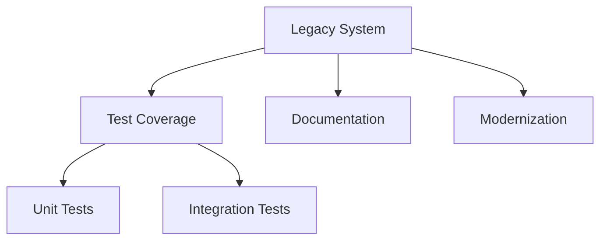

# Managing Legacy Code Testing

<ChallengeDifficulty :rating="4" />
<TimeEstimate time="3-4 days" />

## Executive Summary
This challenge focuses on effectively testing and maintaining legacy code while ensuring system stability and enabling gradual modernization.

## Problem Statement
Organizations need to:
- Test legacy systems effectively
- Maintain system stability
- Enable gradual modernization
- Handle technical debt
- Preserve system knowledge

## Technical Context


## Impact Assessment
### Business Impact
- System reliability
- Maintenance costs
- Modernization delays
- Business continuity

### Technical Impact
- Code quality
- Testing complexity
- Knowledge retention
- Technical debt

## Solution Approaches

### 1. Legacy Code Testing
```typescript
interface LegacySystem {
  components: {
    name: string;
    coverage: number;
    risks: string[];
    dependencies: string[];
  }[];
}

class LegacyTestStrategy {
  assessSystem(system: LegacySystem) {
    return system.components.map(component => ({
      ...component,
      testPriority: this.calculatePriority(component),
      recommendedApproach: this.determineApproach(component)
    }));
  }

  private calculatePriority(component: any) {
    // Priority calculation logic
  }

  private determineApproach(component: any) {
    // Approach determination logic
  }
}
```

### 2. Modernization Strategy
- Incremental refactoring
- Test automation
- Documentation updates
- Knowledge transfer

### 3. Risk Management
- Impact analysis
- Regression testing
- Backup procedures
- Monitoring systems

## Expert Tips
- Start with high-risk areas
- Document everything
- Use automated testing
- Plan incremental changes

## References
- [Legacy Code Patterns](https://example.com/legacy-patterns)
- [Modernization Guide](https://example.com/modernization)