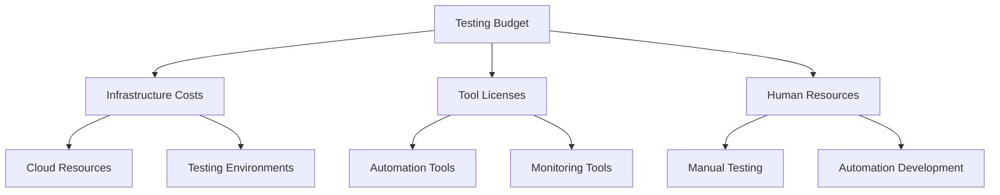

# Cost Management in Testing

<ChallengeDifficulty :rating="3" />
<TimeEstimate time="Ongoing" />

## Executive Summary
This challenge addresses the critical task of managing and optimizing testing costs while maintaining high quality standards in software testing operations.

## Problem Statement
Organizations need to:
- Optimize testing resource allocation
- Reduce testing costs without compromising quality
- Manage tool and infrastructure expenses
- Balance automated vs manual testing costs
- Track and forecast testing budgets

## Technical Context


## Impact Assessment
### Business Impact
- Budget overruns
- Resource underutilization
- Delayed releases
- Quality compromises

### Technical Impact
- Limited tool access
- Infrastructure constraints
- Technical debt
- Automation gaps

## Solution Approaches

### 1. Cost Optimization Strategy
```javascript
// Cost tracking system example
class TestingCostTracker {
  constructor() {
    this.costs = {
      infrastructure: 0,
      licenses: 0,
      personnel: 0
    };
  }

  trackCost(category, amount) {
    this.costs[category] += amount;
    this.analyzeThresholds();
  }

  analyzeThresholds() {
    const totalCost = Object.values(this.costs).reduce((a, b) => a + b, 0);
    if (totalCost > BUDGET_THRESHOLD) {
      this.triggerOptimizationAlert();
    }
  }
}
```

### 2. Resource Optimization
- Implement dynamic resource allocation
- Use cloud cost optimization tools
- Implement automated scaling policies

### 3. Tool License Management
- Regular license audits
- Usage-based licensing models
- Open-source alternatives evaluation

## Expert Tips
- Regular cost-benefit analysis
- Implement usage monitoring
- Optimize cloud resources
- Consider hybrid testing approaches

## References
- [Cloud Cost Optimization Guide](https://example.com/cloud-cost)
- [Testing ROI Calculator](https://example.com/testing-roi)