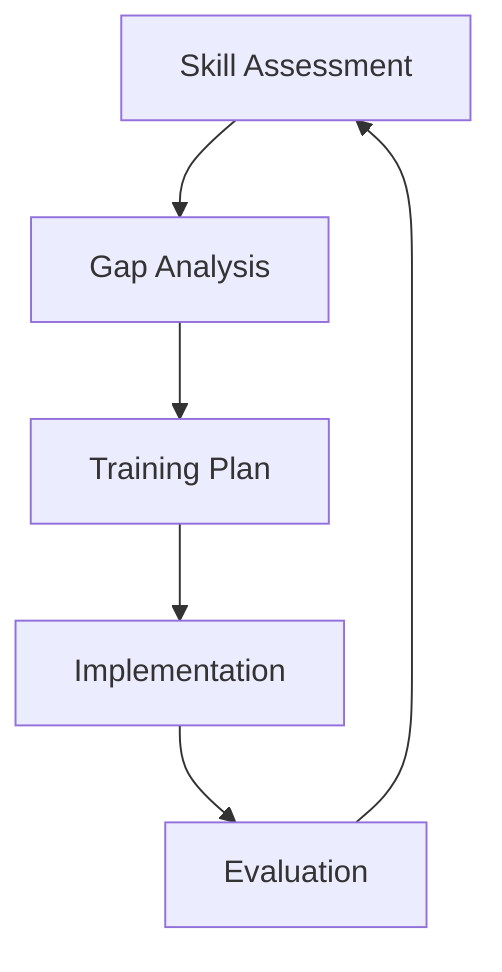

# Managing Skill Gaps in Testing Teams

<ChallengeDifficulty :rating="3" />
<TimeEstimate time="Ongoing" />

## Executive Summary
This challenge focuses on identifying and addressing skill gaps in testing teams while ensuring continuous learning and adaptation to new technologies.

## Problem Statement
Testing teams need to:
- Assess current skill levels
- Identify required competencies
- Plan training programs
- Track skill development
- Adapt to new technologies

## Technical Context


## Impact Assessment
### Business Impact
- Project delays
- Quality issues
- Increased costs
- Competitive disadvantage

### Technical Impact
- Technical debt
- Testing inefficiencies
- Tool underutilization
- Automation challenges

## Solution Approaches

### 1. Skill Assessment Framework
```typescript
interface SkillMatrix {
  technical: {
    automation: number;
    performance: number;
    security: number;
  };
  soft: {
    communication: number;
    problemSolving: number;
    teamwork: number;
  };
}

class SkillAssessment {
  assessTeamMember(matrix: SkillMatrix): {
    gaps: string[];
    recommendations: string[];
  } {
    const gaps = [];
    const recommendations = [];
    
    // Assessment logic
    return { gaps, recommendations };
  }
}
```

### 2. Training Program Implementation
- Structured learning paths
- Mentorship programs
- Certification tracks

### 3. Continuous Learning Framework
- Regular skill assessments
- Technology workshops
- Knowledge sharing sessions

## Expert Tips
- Regular skill assessments
- Personalized learning paths
- Practical exercises
- Peer learning programs

## References
- [Testing Skills Framework](https://example.com/testing-skills)
- [Learning Path Guide](https://example.com/learning-paths)