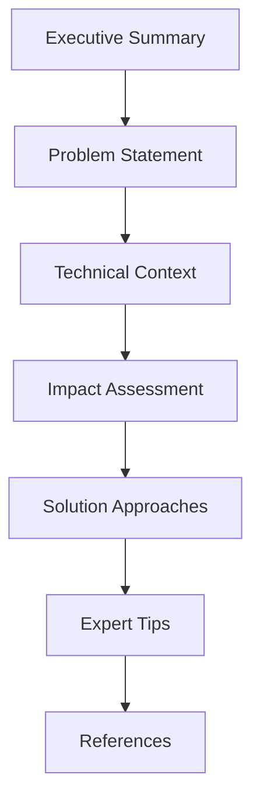

# Introduction to Testing & QA Challenges

Welcome to Testing & QA Challenges, your comprehensive resource for tackling real-world software testing challenges. This documentation is designed to help testing professionals develop practical skills through hands-on examples and solutions.

## Purpose

This documentation serves as a:
- Practical guide for implementing testing solutions
- Reference for best practices and patterns
- Learning resource for testing professionals
- Community-driven knowledge base

## How It's Organized

Our challenges are organized into key categories:

### Performance Testing
Testing systems under load and stress conditions:
- Load testing at scale
- Real-time analytics testing
- Performance optimization

### Security Testing
Ensuring system security and compliance:
- OAuth implementation
- API security
- Penetration testing

### Integration Testing
Testing system components working together:
- Microservices integration
- Database integration
- Third-party system integration

### Management Challenges
Handling testing team and process challenges:
- Cost management
- Skill gaps
- Team coordination

### Process & Team
Managing testing processes and team dynamics:
- Knowledge sharing
- Change management
- Cultural differences

## Challenge Structure

Each challenge follows a consistent format:

### Components
1. **Executive Summary**: Brief overview of the challenge
2. **Problem Statement**: Detailed description of the testing problem
3. **Technical Context**: System architecture and constraints
4. **Impact Assessment**: Business and technical impact
5. **Solution Approaches**: Multiple detailed solutions
6. **Expert Tips**: Key insights and recommendations
7. **References**: Additional resources and documentation

## Getting Started

1. Browse the [Challenges](/challenges/) section
2. Check the difficulty level and time commitment
3. Review the problem statement and context
4. Implement the suggested solutions
5. Share your learnings with the community

## Using This Documentation

### For Individual Learning
- Start with challenges matching your skill level
- Follow the step-by-step solutions
- Experiment with different approaches
- Build your own test implementations

### For Teams
- Use as training material
- Reference for best practices
- Template for solving similar challenges
- Guide for implementing testing strategies

## Contributing

We welcome contributions from the testing community! You can:
- Add new challenges
- Improve existing solutions
- Share alternative approaches
- Fix documentation issues

Visit our [Contribution Guide](/contribute/) to learn more.

## Support

Need help? You can:
- Check our [Resources](/resources/) section
- Join community discussions
- Review related challenges
- Contact our support team

## Next Steps

- Browse our [Challenge Categories](/challenges/)
- Check out our [Resources](/resources/)
- Learn how to [Contribute](/contribute/)
- Join our community

Let's start exploring and solving testing challenges together!